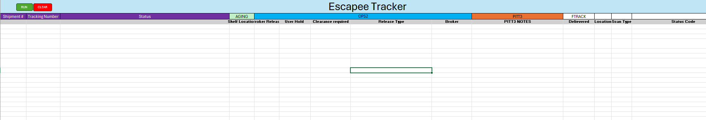
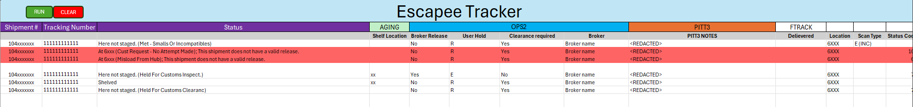

# EscapeeTracker

## Overview
EscapeeTracker is a VBA Excel-based tool designed to streamline the process of tracking shipments potentially without a valid customs release. Originally developed to aid coworkers tasked with identifying such "escapees" from SAP data, this tool has transformed the labor-intensive process into a swift and automated task.

## How it Works
1. **Automated Tracking:** Users paste the SAP data into Excel (Just the shipment number and tracking number). With a simple click on 'RUN', the tool automatically tracks each shipment's status across multiple platforms.
2. **Quick Status Verification:** EscapeeTracker integrates various logistics data directly into Excel, enabling the immediate identification of shipments that have escaped without the necessary customs release.

## Key Benefits
- **Massive Time Savings:** What used to take 2-3 minutes per shipment to manually verify now takes a fraction of the time. For instance, tracking about 1000 shipments for the month of April only took 50 minutes, a task that would have previously occupied an entire shift or more.
- **Enhanced Accuracy:** Automates tracking and reduces human error in the verification process.
- **User-Friendly Interface:** Easy to use with minimal training required.

# Visual Overview
Included in this repository is a screenshot demonstrating the user interface of EscapeeTracker. This image shows how users can interact with the tool, including buttons for 'RUN' and 'CLEAR', and columns displaying shipment data, status, and other relevant details. Please note, the data in the screenshot has been anonymized to protect confidentiality.

## Acknowledgments
- Thanks to my coworkers for their invaluable feedback and suggestions that have significantly improved the functionality and usability of this tracker.