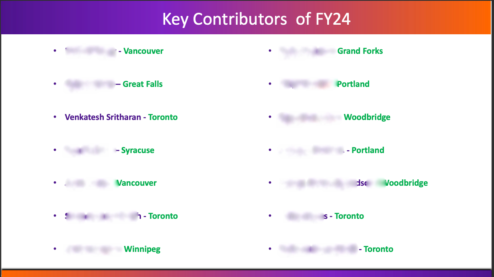

# Process Automation

## Overview

Welcome to the `process-automation` repository! My name is Venkatesh Sritharan, and I have been working as a Customs Associate at FedEx Ground, a non-tech. Despite this, I've leveraged my programming knowledge to create various tools that have transformed our workflows, increasing efficiency and accuracy significantly. This repository is a collection of those automation tools, each designed to address specific operational challenges within our team and beyond.

## Impact

Bringing technology into a non-technical role, I have developed solutions that automate mundane tasks, reduce errors, and save time. These innovations have not only enhanced team productivity but have also been recognized at a corporate level. I was honored as a Key Contributor for the first quarter of FY24, a testament to the positive changes brought about by these tools.

## Projects

This repository includes several projects I've developed, including:

- **EscapeeTracker**: A VBA Excel-based tool that automates the tracking of shipments potentially without a valid customs release. For more details, see the [EscapeeTracker](./EscapeeTracker/README.md) directory.

### Adding More Projects

I will be updating this repo as I develop or update projects. Each project will have its own directory and README with detailed information about its purpose, usage, etc.
